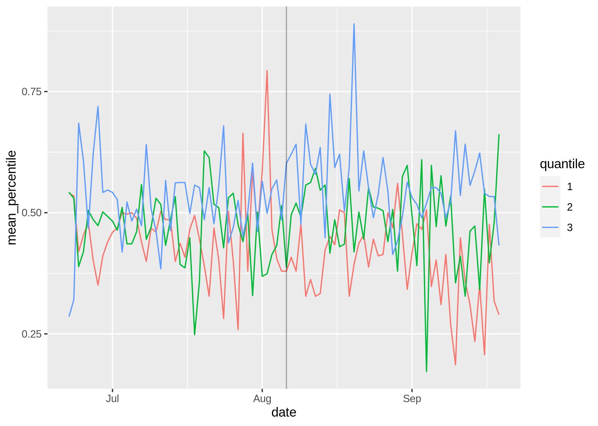
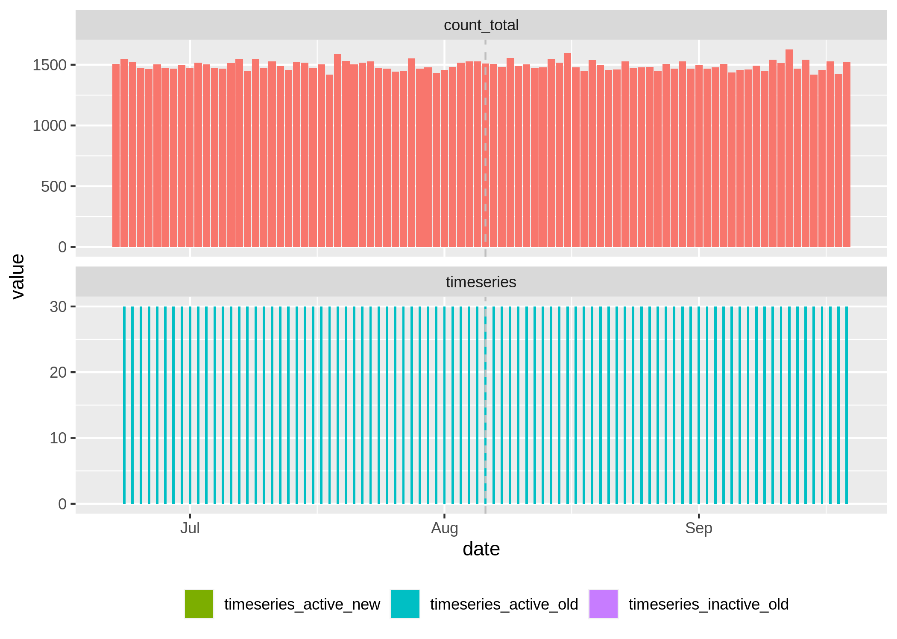
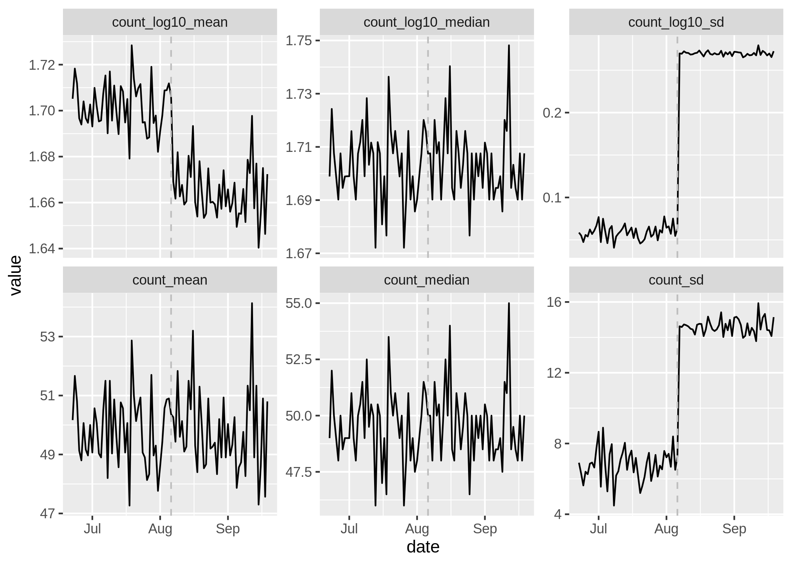
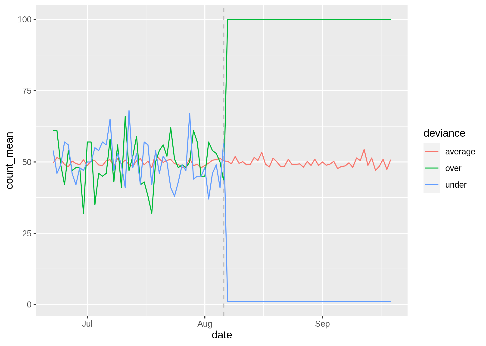

<!-- README.md is generated from README.Rmd. Please edit that file -->

# tscompare

<!-- badges: start -->
<!-- badges: end -->

The goal of tscompare is to provide an analytics library for Community
Health Worker related data.

## Installation

You can install lhe development version of tscompare from
[GitHub](https://github.com/) with:

``` r
# install.packages("devtools")
devtools::install_github("roboton/tscompare")
```

## Example

This is a basic example with simulated data with two worker anomalies
(one over and one under).

``` r
library(tscompare)
set.seed(143)
num_dates <- 90
num_workers <- 30
# generate synthetic data
test_data <- setNames(
  merge(as.character(1:num_workers),
        seq(Sys.Date(), Sys.Date() + (num_dates - 1), by = 1),
        colnames = c("worker_id", "date")), c("worker_id", "date"))
start_date <- Sys.Date() + floor(num_dates / 2)
test_data$count <- sapply(1:(num_dates*num_workers),
                          function(x) { rpois(1, 50) })
# worker anomalies
test_data[test_data$worker_id == "1" &
            test_data$date > start_date, "count"] <- 100
test_data[test_data$worker_id == "2" &
            test_data$date > start_date, "count"] <- 1

output_dir <- worker_analysis(
  test_data, "test_analysis", start_date = start_date, period = "day",
  sig_p = 0.01)
#> Warning in worker_analysis(test_data, "test_analysis", start_date =
#> start_date, : computing worker models for app_id: test_analysis
#> test_analysis/app_workers_model.rds
#> Saving 7 x 5 in image
#> Saving 7 x 5 in image
#> Saving 7 x 5 in image
#> Saving 7 x 5 in image
#> Saving 7 x 5 in image
#> Saving 7 x 5 in image
#> Saving 7 x 5 in image
#> Saving 7 x 5 in image
#> Saving 7 x 5 in image
#> Warning: `guides(<scale> = FALSE)` is deprecated. Please use `guides(<scale> =
#> "none")` instead.
#> Saving 7 x 5 in image
#> Saving 7 x 5 in image
#> Warning: `guides(<scale> = FALSE)` is deprecated. Please use `guides(<scale> =
#> "none")` instead.
#> Saving 7 x 5 in image
#> Saving 7 x 5 in image
paste("worker analysis output in directory:", output_dir)
#> [1] "worker analysis output in directory: test_analysis"
```

``` r
output_pngs <- list.files("test_analysis/output", pattern = ".png$")

for(png in output_pngs){
  cat("\n") 
  cat("", sep = "")
  cat("\n")
}
```











